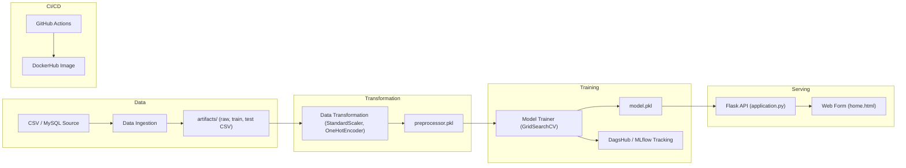
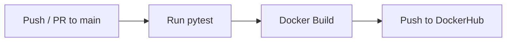

# Loan Approval Prediction System

---

## 📌 Project Overview

An end-to-end machine-learning web application that predicts loan approval eligibility. The system covers the full ML lifecycle — data ingestion, feature engineering, model training with hyperparameter tuning, experiment tracking via MLflow/DagsHub, and real-time inference through a Flask web interface. The application is containerized with Docker and deployed via a GitHub Actions CI/CD pipeline.

- **Goal**: Automate loan eligibility decisions using classical ML classifiers with a clean, user-friendly web form.
- **Dataset**: ~600 records from the Loan Prediction dataset (`notebook/data/loan.csv`), with an 80/20 train-test split.
- **Target**: `Loan_Status` column where `'Y'` means loan approved and `'N'` means loan not approved.

---

## 🏗️ Architecture Diagram



---

## 📂 Project Structure

```
Loan-Approval-Prediction/
├── .github/workflows/
│   └── cicd.yml                  # CI/CD pipeline (test → Docker build & push)
├── artifacts/
│   ├── raw.csv                   # Full dataset snapshot
│   ├── train.csv                 # Training split (80%)
│   ├── test.csv                  # Testing split (20%)
│   ├── preprocessor.pkl          # Fitted ColumnTransformer
│   └── model.pkl                 # Best trained model
├── notebook/
│   ├── data/
│   │   └── loan.csv              # Original dataset
│   ├── loan-approval-prediction-using-svm.ipynb
│   └── step-by-step-guide-to-gridsearchcv.ipynb
├── src/LAP/
│   ├── components/
│   │   ├── data_ingestion.py     # Reads CSV (or MySQL), creates train/test splits
│   │   ├── data_transformation.py# Builds sklearn preprocessing pipelines
│   │   ├── model_tranier.py      # Trains & evaluates multiple classifiers
│   │   └── model_monitering.py   # Placeholder for model monitoring
│   ├── pipelines/
│   │   ├── prediction_pipeline.py# Loads model + preprocessor for inference
│   │   └── training_pipeline.py  # Placeholder for orchestrated training
│   ├── exception.py              # Custom exception with traceback details
│   ├── logger.py                 # File-based logging (logs/ directory)
│   └── utils.py                  # Helpers: save/load pickle, evaluate_models, read_sql
├── templates/
│   ├── home.html                 # Loan prediction web form
│   └── index.html                # Minimal index page
├── tests/
│   └── test_app.py               # Basic Flask route test
├── application.py                # Flask app entry point (dev server)
├── main.py                       # Training pipeline entry point
├── template.py                   # Project scaffolding script
├── setup.py                      # Package configuration (LAP v0.0.1)
├── requirements.txt              # Python dependencies
├── Dockerfile                    # Multi-stage Docker build (Gunicorn)
├── .env                          # MySQL connection credentials
└── .dvc / .dvcignore             # DVC data versioning config
```

---

## 🛠️ Tech Stack

| Category              | Technologies                                                              |
| --------------------- | ------------------------------------------------------------------------- |
| **Backend**           | Python 3.10+, Flask                                                       |
| **ML / Data Science** | scikit-learn, Pandas, NumPy, Seaborn, Plotly                              |
| **Models Trained**    | Logistic Regression, Naive Bayes, KNN, Decision Tree, Random Forest, SVC  |
| **Experiment Tracking** | MLflow, DagsHub                                                         |
| **Data Versioning**   | DVC                                                                       |
| **Database**          | MySQL (PyMySQL) — optional data source                                    |
| **Container**         | Docker (multi-stage build, Gunicorn)                                      |
| **CI/CD**             | GitHub Actions → DockerHub                                                |
| **Cloud (AWS)**       | ECR, ECS (Fargate), IAM           |
| **Monitoring**        | CloudWatch, MLflow (DagsHub)                                              |
| **Testing**           | pytest                                                                    |

---

## 🔬 ML Pipeline Details

### Data Ingestion (`data_ingestion.py`)
- Reads the loan dataset from `notebook/data/loan.csv` (with a MySQL fallback via `utils.read_sql_data()`).
- Saves raw, train, and test CSVs to `artifacts/`.
- Train/test split: **80/20** with `sklearn.train_test_split`.

### Data Transformation (`data_transformation.py`)
- **Discrete numerical** (`Credit_History`, `Loan_Amount_Term`): `SimpleImputer(most_frequent)` → `StandardScaler`
- **Continuous numerical** (`LoanAmount`, `CoapplicantIncome`, `ApplicantIncome`): `SimpleImputer(median)` → `StandardScaler`
- **Categorical** (`Gender`, `Married`, `Dependents`, `Education`, `Self_Employed`, `Property_Area`): `SimpleImputer(most_frequent)` → `OneHotEncoder`
- All assembled via `sklearn.compose.ColumnTransformer` and persisted as `preprocessor.pkl`.

### Model Training (`model_tranier.py`)
- Trains **6 classifiers** with `GridSearchCV` (3-fold CV):
  - Logistic Regression, Gaussian Naive Bayes, KNN, Decision Tree, Random Forest, SVC
- Selects the best model by **accuracy score**.
- Logs metrics (`accuracy`, `precision`, `f1`) and the model artifact to **DagsHub/MLflow**.
- Saves the best model as `model.pkl`.
- Rejects models with accuracy < 0.6.

### Prediction Pipeline (`prediction_pipeline.py`)
- Loads `preprocessor.pkl` and `model.pkl` from `artifacts/`.
- `CustomData` class maps form inputs to a Pandas DataFrame.
- Returns prediction: `🟢 Loan Approved` or `🔴 Loan Rejected`.

---

## 📦 Installation & Setup

### Prerequisites
- Python 3.10+
- Conda (recommended) or virtualenv
- MySQL (optional — only needed if ingesting data from a database)

### Local Development

1. **Clone the repository**
   ```bash
   git clone https://github.com/harshal3558/Loan-Approval-Prediction.git
   cd Loan-Approval-Prediction
   ```

2. **Create a Python environment**
   ```bash
   conda create -p ./lenv python=3.10 -y
   conda activate ./lenv
   ```

3. **Install dependencies**
   ```bash
   pip install -r requirements.txt
   ```

4. **Configure environment variables** (optional — for MySQL ingestion)
   Update the `.env` file with your MySQL credentials:
   ```env
   host=localhost
   user=root
   password=your_password
   db=loan
   ```

5. **Train the model** (generates artifacts)
   ```bash
   python main.py
   ```

6. **Run the Flask app**
   ```bash
   python application.py
   ```
   Visit `http://127.0.0.1:5000` to access the prediction form.

---

### 🐳 Docker

```bash
# Build the image (multi-stage, runs with Gunicorn)
docker build -t loan-prediction-app .

# Run the container
docker run -p 5000:5000 loan-prediction-app
```

The Dockerfile uses a **multi-stage build** — a builder stage installs dependencies into a virtual environment, and the runtime stage copies only the venv and app code, running as a non-root user (`appuser`) with Gunicorn.

---

### ☁️ AWS Deployment (ECS Fargate)

The application can be deployed to **AWS ECS (Fargate)** for a fully managed, serverless container runtime.

#### Prerequisites
- AWS CLI configured with appropriate **IAM** credentials
- An **Amazon ECR** (Elastic Container Registry) repository created
- An ECS cluster with Fargate launch type

#### Steps

1. **Authenticate Docker with Amazon ECR**
   ```bash
   aws ecr get-login-password --region <region> |
     docker login --username AWS --password-stdin <aws_account_id>.dkr.ecr.<region>.amazonaws.com
   ```

2. **Tag and push the image to ECR**
   ```bash
   docker tag loan-prediction-app:latest <aws_account_id>.dkr.ecr.<region>.amazonaws.com/loan-app:latest
   docker push <aws_account_id>.dkr.ecr.<region>.amazonaws.com/loan-app:latest
   ```

3. **Create an ECS Fargate Task Definition** — reference the ECR image URI, configure CPU/memory (e.g. 0.5 vCPU, 1 GB), and map container port `5000`.

4. **Create/update an ECS Service** — attach an **Application Load Balancer (ALB)** for HTTPS termination and health checks (`GET /` → `200 OK`).

5. **Configure environment variables** — set `DB_HOST`, `DB_USER`, `DB_PASSWORD` in the task definition or via **AWS Systems Manager Parameter Store / Secrets Manager**.

6. **Enable logging** — forward container logs to **CloudWatch** for monitoring and alerting.

#### Required IAM Permissions
| Service | Permissions Needed |
| ------- | ------------------ |
| **ECR** | `ecr:GetAuthorizationToken`, `ecr:BatchCheckLayerAvailability`, `ecr:PutImage`, `ecr:InitiateLayerUpload`, `ecr:UploadLayerPart`, `ecr:CompleteLayerUpload` |
| **ECS** | `ecs:CreateService`, `ecs:UpdateService`, `ecs:RegisterTaskDefinition`, `ecs:RunTask` |
| **IAM** | Task execution role with `AmazonECSTaskExecutionRolePolicy` |
| **CloudWatch** | `logs:CreateLogGroup`, `logs:CreateLogStream`, `logs:PutLogEvents` |

---

## 🔌 API Reference

| Method | Endpoint        | Description                                    |
| ------ | --------------- | ---------------------------------------------- |
| `GET`  | `/`             | Renders the home page with the prediction form |
| `GET`  | `/predictdata`  | Also renders the home page (iframe support)    |
| `POST` | `/predictdata`  | Accepts form data and returns a prediction     |

### Input Fields (form-urlencoded)

| Field               | Type    | Values / Example                         |
| ------------------- | ------- | ---------------------------------------- |
| `Gender`            | string  | `Male`, `Female`                         |
| `Married`           | string  | `Yes`, `No`                              |
| `Dependents`        | string  | `0`, `1`, `2`, `3+`                      |
| `Education`         | string  | `Graduate`, `Not Graduate`               |
| `Self_Employed`     | string  | `Yes`, `No`                              |
| `ApplicantIncome`   | integer | `5000`                                   |
| `CoapplicantIncome` | integer | `2000`                                   |
| `LoanAmount`        | integer | `150`                                    |
| `Loan_Amount_Term`  | integer | `360`                                    |
| `Credit_History`    | float   | `1.0` (Good), `0.0` (Bad)               |
| `Property_Area`     | string  | `Urban`, `Semiurban`, `Rural`            |

### Response

An HTML snippet displaying:
- `🟢 Loan Approved` — prediction class `0`
- `🔴 Loan Rejected` — prediction class `1`

---

## ⚙️ CI/CD Pipeline

The GitHub Actions workflow (`.github/workflows/cicd.yml`) runs on pushes and PRs to `main`:

1. **Test Job** — Sets up Python 3.9, installs dependencies, and runs `pytest -v`.
2. **Docker Job** (depends on test) — Builds the Docker image and pushes to **DockerHub** using repository secrets (`DOCKER_USERNAME`, `DOCKER_PASSWORD`).



---

## 📹 Demo Video

Watch the deployment walkthrough:
[Deployment Video](https://drive.google.com/file/d/1XPcGe21EjQXIbaMoPnQJstcbxX67TR3I/view?usp=sharing)

---

## 📈 Operational Guidance

- **Logging**: Timestamped log files written to `logs/` directory via `src/LAP/logger.py`. Each run creates a new log file with format `MM_DD_YYYY_HH_MM_SS.log`.
- **Experiment Tracking**: Metrics and model artifacts are logged to [DagsHub MLflow](https://dagshub.com/harshal3558/Loan-Approval-Prediction.mlflow).
- **Health Check**: `GET /` returns `200 OK` with the home page.
- **Error Handling**: Custom exceptions (`src/LAP/exception.py`) provide filename, line number, and error message for debugging.

---

## 🧪 Testing

- Tests are located in `tests/test_app.py`.
- Run with:
  ```bash
  python -m pytest -v
  ```
- CI runs tests automatically on every push/PR to `main`.

---

## 🤝 Contributing

1. Fork the repository.
2. Create a feature branch (`git checkout -b feat/your-feature`).
3. Write tests for any new functionality.
4. Submit a PR with a clear description and reference the related issue.
5. Ensure the PR passes all CI checks before requesting review.

---

## 📜 License & Contact

**License:** MIT © 2024 Harshal

**Maintainer:** Harshal — [harshal3558@gmail.com](mailto:harshal3558@gmail.com)

**Project Link:** [https://github.com/harshal3558/Loan-Approval-Prediction](https://github.com/harshal3558/Loan-Approval-Prediction)